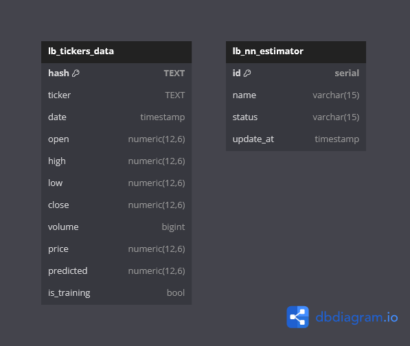

# 3_db

O container 3_db realiza é o bando de dados de toda a architetura, e opera salvando status do modelo, assim como registrando o histórico dos dados do ticker. 

## Instalação

    - A instação do banco é realizado somente pela orquestração do container no [docker-compose.yaml ](../docker-compose.yaml), após o downlaod da imagem e configuração de volume o banco irá normalmente.
  
## Diagrama de Entida e Relacionamento (DEER)

    - O DEER abaixo demostra como o banco foi estruturado para salvar as informações necessárias para o funcionamento da arquitetura.

