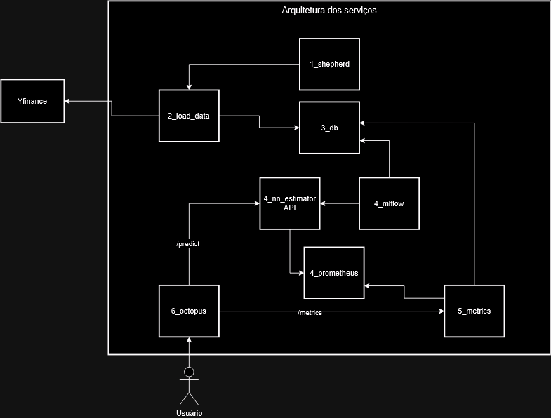

# Tech challange fase 4

O presente repositório trata-se da entrega do Tech Challange fase 4 do curso de pós graduação Machine Learning Engineering do grupo 45. O trabalho apresenta uma arquitetura criada para atender os requisitos da atividade proposta
    - Coleta e pré processamento de dados.
    - Desenvolvimento de um modelo LSTM.
    - Salvamento e exportação do modelo.
    - Deploy do modelo.
    - Escalabilidade e monitoramento.

## Arquitetura

A arquitetura dos serviços é representada visualmente pela imagem abaixo

Onde :

1. **1_shepherd**:
   - É um script agendado, que roda perioódicamente para realizar novamente a tarefa de extração de dados. Além disso é reponsável por verificar a necessidade de realizar fine tunning no modelo novamente, comaparando a data dos registros atuais com os ultimos registro salvos no banco, quando a diferença for maior que o periodo estipulado pelo shepherd é realizada nova extração de dados e fine tunning para atualizar o modelo.
   - [Mais detalhes sobre o shepheard ](./1_shepherd/)

2. **2_load_data**:
   - É uma api feita em fastApi para interação com o a api externa a arquitetura Yfinance, ela é responsável realizar busca na api yfinance, utilizando-se de parâmetros informados na requisição, sendo eles
     - ticket
     - start_date
     - end_date
   - Após busca filtrada os dados são salvos no 3_db, estes dados serão posteriormente utilizadados para treinamento/validação do modelo que será exposto por 4_nn_estimator.
   - [Mais detalhes sobre o load_data ](./2_load_data/)

3. **3_db**:
   - É um banco de dados postgres configurado somente no docker-compose.yaml, utiliza-se de um script de inicizalização para criar as tabelas necessárias para o funcionamento da architetura. É onde ficam quardados os dados de treinamento, informações sobre o estimador e seu status.
   - [Mais detalhes sobre o 3_db ](./3_db/)

## Funcionamento

1. **Crie um ambiente virtual**:

2. **Instale as dependencias**:

3. **Execute a aplicação**:

